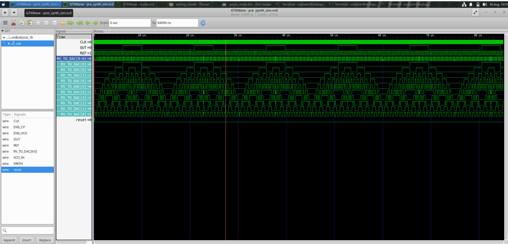
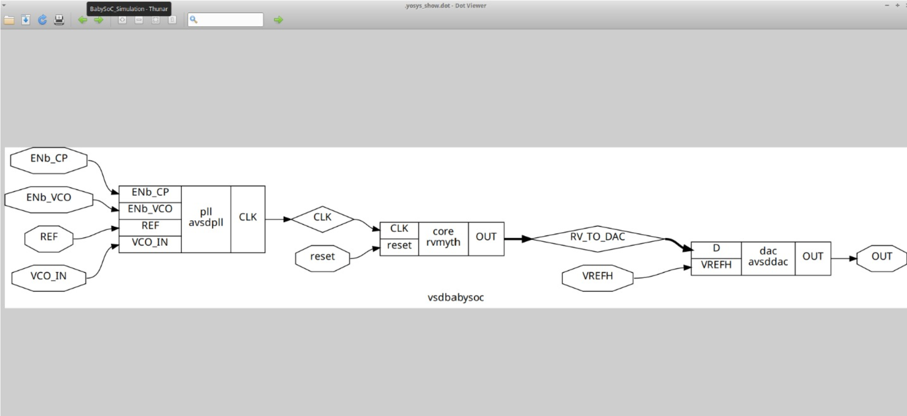
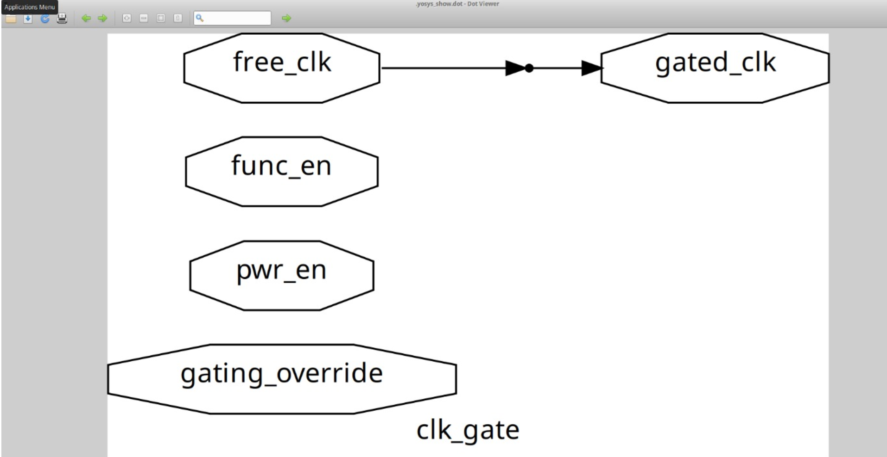
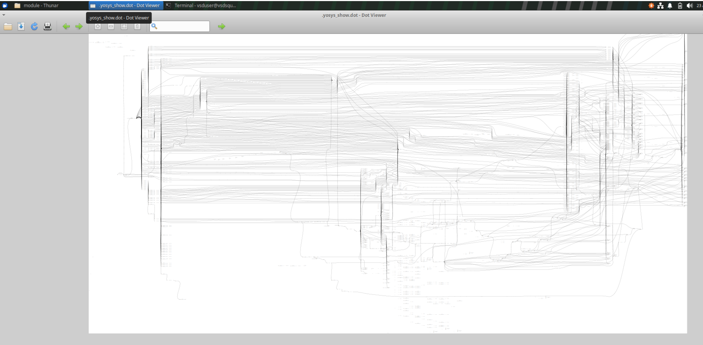
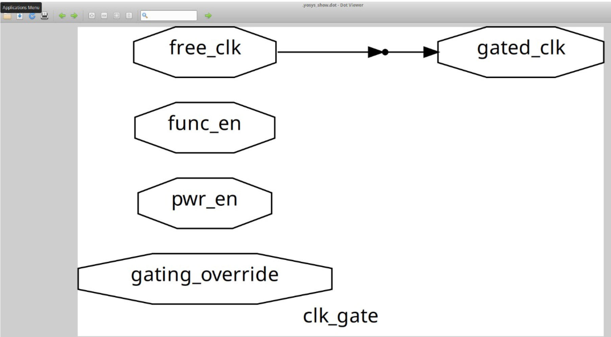
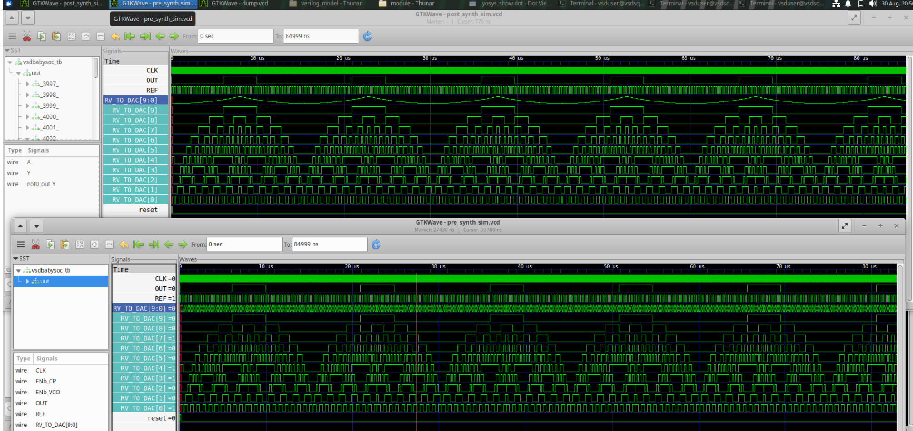

# VLSI RTL Design and Synthesis

This repository contains my hands-on work completed during the **VLSI RTL Design and Synthesis training**. The work covers RTL design, Verilog coding, functional simulation, testbench development, waveform analysis, RTL synthesis, standard-cell libraries, sequential logic, hierarchical design, logic optimization, Gate-Level Simulation (GLS), synthesis-oriented RTL coding, hardware inference, technology mapping, and synthesized netlist analysis.

The repository contains practical work from **Modules 1–5**, covering the RTL-to-hardware design flow from basic Verilog RTL description and functional verification to synthesis, optimization, gate-level verification, and analysis of the hardware inferred from RTL coding styles.

---

## Module 1 – RTL Design, Simulation and Synthesis

Module 1 introduced the fundamentals of RTL design and the basic RTL-to-hardware flow using a **2:1 multiplexer** as the primary design example. The module covered Verilog RTL coding, testbench development, functional simulation, VCD generation, waveform analysis using GTKWave, RTL synthesis using Yosys, and technology mapping to the SKY130 standard-cell library.

### Work Completed

* Introduction to RTL design
* Understanding Register Transfer Level (RTL)
* Understanding inputs, outputs, combinational operations, registers, clocked behavior, and control signals
* Verilog RTL coding
* Design of a 2:1 multiplexer
* Understanding MUX functional behavior
* Boolean representation of a 2:1 MUX
* Combinational RTL implementation
* MUX implementation using `always @(*)`
* MUX implementation using conditional operators
* Testbench development
* Input stimulus generation
* Functional verification of RTL
* Simulation using Icarus Verilog
* Compilation and execution of Verilog designs
* Value Change Dump (VCD) generation
* Recording signal activity during simulation
* Waveform visualization using GTKWave
* Analysis of MUX input and output transitions
* Introduction to RTL synthesis
* Synthesis using Yosys
* RTL processing and logic optimization
* Netlist generation
* Introduction to standard-cell libraries
* SKY130 standard-cell technology mapping
* Mapping RTL logic to technology-specific cells
* Gate-level netlist generation
* Analysis of synthesized hardware representation

The complete Module 1 flow progressed from RTL coding and testbench development through simulation and waveform verification to Yosys synthesis and SKY130 technology mapping.

---

## Module 2 – RTL Synthesis and Sequential Logic

Module 2 moved beyond basic combinational RTL and focused on how RTL descriptions are transformed into synthesized hardware. The module introduced Yosys synthesis, standard-cell libraries, Liberty (`.lib`) files, technology mapping, sequential logic, D flip-flops, asynchronous controls, hierarchical RTL design, and arithmetic hardware synthesis.

### Work Completed

* Understanding the purpose of RTL synthesis
* Understanding RTL-to-netlist conversion
* Introduction to Yosys synthesis
* RTL elaboration
* RTL processing
* Boolean optimization
* Constant propagation
* Logic simplification
* Technology mapping
* Netlist generation
* Understanding standard-cell libraries
* Study of common standard cells
* Understanding different cell drive strengths
* Introduction to Liberty (`.lib`) files
* Analysis of cell names and pin information
* Understanding input and output directions
* Understanding logic functions
* Understanding timing information
* Understanding area and power information
* Understanding sequential cell behavior
* Understanding operating conditions
* Mapping logical RTL functions to standard cells
* Understanding combinational and sequential hardware
* Introduction to sequential logic
* D Flip-Flop implementation
* Understanding clocked data capture
* D Flip-Flop with asynchronous reset
* Analysis of asynchronous reset behavior
* D Flip-Flop with asynchronous set
* Analysis of asynchronous set behavior
* Simulation of sequential circuits
* Waveform verification of clock, data, reset, set, and output signals
* Hierarchical RTL design
* Creating submodules
* Connecting multiple RTL modules
* Understanding modular hardware organization
* Reusability and independent verification of submodules
* Multiplier implementation using RTL arithmetic operators
* Synthesis of arithmetic logic
* Analysis of multiplier hardware structures
* Standard-cell mapping of synthesized designs
* Structural analysis of synthesized netlists

The module established the relationship between **RTL, Yosys processing, standard-cell libraries, Liberty information, sequential logic, hierarchy, arithmetic RTL, and technology-specific synthesized hardware**.

---

## Module 3 – Combinational and Sequential Logic Optimization

Module 3 focused on the optimization capabilities of RTL synthesis tools. The experiments demonstrated how synthesis can simplify Boolean expressions, propagate constants, remove redundant logic, optimize sequential elements, and reduce unnecessary counter hardware while preserving the required functionality.

### Work Completed

* Introduction to synthesis optimization
* Understanding the need for RTL optimization
* Understanding hardware simplification
* Combinational logic optimization
* Boolean expression simplification
* Constant propagation
* Redundant logic elimination
* Unused signal removal
* Conditional logic optimization
* Simplification of conditional expressions
* Optimization of nested conditional expressions
* Analysis of constant branches
* Optimization of MUX-like conditional structures
* Optimization Check 1
* Constant branch simplification
* Optimization Check 2
* Boolean OR simplification
* Optimization Check 3
* Nested conditional optimization
* Optimization Check 4
* Complex Boolean optimization
* Sequential logic optimization
* D Flip-Flop constant optimization
* Constant-driven register analysis
* Sequential constant propagation
* Register simplification
* Optimization of internal registers
* Reset and output-related optimization
* Removal of unnecessary sequential logic
* Counter optimization
* Analysis of unused counter state
* Optimization of counter comparison logic
* Analysis of observable counter bits
* RTL functional simulation
* Waveform inspection
* Synthesis analysis
* Structural comparison of RTL and synthesized hardware
* Analysis of optimized netlists

The experiments showed that synthesis does not necessarily reproduce the RTL structure directly. Instead, it analyzes the functionality and generates an optimized implementation based on the logic that actually affects the required outputs.

---

## Module 4 – Gate-Level Simulation and RTL Coding Practices

Module 4 focused on RTL coding practices that influence simulation behavior and synthesized hardware. The module studied different MUX coding styles, combinational sensitivity lists, blocking and non-blocking assignments, synthesis, Gate-Level Simulation, and comparison between RTL and synthesized behavior.

### Work Completed

* Understanding different RTL coding styles
* Continuous assignment
* Ternary operator implementation
* Procedural `always` block implementation
* Case-based combinational logic
* 2:1 MUX using ternary operator
* 2:1 MUX using procedural `if` logic
* Understanding combinational sensitivity lists
* Analysis of incomplete sensitivity lists
* Identification of simulation-modeling problems
* Understanding the effect of missing input signals in sensitivity lists
* Correct combinational coding using `always @(*)`
* Understanding automatic sensitivity to signals read by the block
* Blocking assignment using `=`
* Understanding immediate procedural updates
* Analysis of procedural execution order
* Non-blocking assignment using `<=`
* Understanding scheduled sequential updates
* Sequential RTL modeling using clocked `always` blocks
* Comparison of blocking and non-blocking assignments
* Understanding appropriate assignment styles for combinational and sequential logic
* RTL functional simulation
* Synthesis of RTL
* Gate-level netlist generation
* Introduction to Gate-Level Simulation (GLS)
* Simulation of synthesized structural netlists
* Use of standard-cell functional models
* RTL-to-GLS verification flow
* Waveform analysis
* Comparison of RTL and synthesized behavior
* Verification of synthesized hardware

The module demonstrated the complete **RTL → Simulation → Synthesis → Gate-Level Netlist → GLS → Waveform Verification** flow and highlighted the importance of correct RTL coding for predictable simulation and reliable synthesis.

---

## Module 5 – Synthesis-Oriented RTL Coding and Hardware Inference

Module 5 focused on how RTL coding decisions directly influence the hardware inferred during synthesis. The experiments covered incomplete and complete combinational descriptions, latch inference, MUX and DEMUX implementations, `generate` constructs, repeated hardware structures, and ripple-carry adder design.

### Work Completed

* Introduction to synthesis-oriented RTL coding
* Understanding the relationship between RTL coding style and hardware inference
* Combinational RTL description
* Understanding complete and incomplete assignments
* Incomplete `if` statements
* Analysis of missing output assignments
* Understanding latch inference
* Incomplete `if-else if` statements
* Analysis of missing final branches
* Incomplete `case` statements
* Analysis of unspecified selector conditions
* Complete `case` statements
* Use of `default` branches
* Avoiding unintended latch inference
* MUX implementation using RTL
* Generate-based MUX implementation
* DEMUX implementation using `case`
* DEMUX implementation using `generate`
* Understanding selection and routing logic
* Introduction to `generate` constructs
* Understanding `genvar`
* Generate loops
* Repeated hardware structures
* Structural RTL representation
* Scalable hardware descriptions
* Parameterized and repetitive hardware concepts
* Ripple-carry adder implementation
* Full-adder structure
* Intermediate carry signals
* Carry propagation
* Generate-based repeated full-adder structures
* RTL simulation
* Waveform verification
* Synthesis using Yosys
* Hardware inference analysis
* Synthesized netlist inspection
* Comparison of different RTL coding styles
* Analysis of the effect of coding style on inferred hardware

The module demonstrated that incomplete combinational assignments can cause synthesis to infer storage elements such as latches, while complete assignments and appropriate structural descriptions produce predictable combinational hardware.

---

## Overall Training Coverage

Across **Modules 1–5**, the training progressed from fundamental RTL design to synthesis, optimization, gate-level verification, and synthesis-oriented hardware inference.

The overall learning flow can be summarized as:

```text
RTL DESIGN
     |
     v
VERILOG CODING
     |
     v
TESTBENCH DEVELOPMENT
     |
     v
FUNCTIONAL SIMULATION
     |
     v
VCD GENERATION
     |
     v
GTKWAVE ANALYSIS
     |
     v
YOSYS SYNTHESIS
     |
     v
RTL PROCESSING
     |
     v
LOGIC OPTIMIZATION
     |
     v
STANDARD-CELL LIBRARY
     |
     v
TECHNOLOGY MAPPING
     |
     v
SYNTHESIZED NETLIST
     |
     v
GATE-LEVEL SIMULATION
     |
     v
WAVEFORM VERIFICATION
     |
     v
HARDWARE INFERENCE ANALYSIS
```

## The individual modules progressively introduced this flow: Module 1 established RTL design and simulation, Module 2 introduced synthesis and sequential hardware, Module 3 explored optimization, Module 4 introduced GLS and coding semantics, and Module 5 focused on synthesis-oriented coding and hardware inference.

## Key Tools and Technologies

* **Verilog** – RTL design and hardware description
* **Icarus Verilog** – RTL functional simulation
* **GTKWave** – VCD waveform visualization and analysis
* **Yosys** – RTL synthesis, processing, and optimization
* **ABC** – Logic optimization and technology mapping where applicable
* **SKY130** – Standard-cell technology used for technology mapping
* **Liberty (`.lib`) files** – Standard-cell functional, timing, area, power, and operating-condition information
* **Standard-cell libraries** – Technology-specific hardware building blocks
* **Gate-Level Netlists** – Structural representation of synthesized hardware

The modules specifically cover Yosys operations such as RTL reading, hierarchy elaboration, process conversion, optimization, technology mapping, and netlist generation, together with standard-cell library usage.

---

## Overall Learning Outcomes

The training provided practical understanding of:

* RTL design methodology
* Verilog hardware description
* Combinational logic
* Sequential logic
* 2:1 multiplexer design
* Testbench development
* Functional simulation
* VCD generation
* GTKWave waveform analysis
* RTL synthesis
* Yosys synthesis flow
* RTL elaboration and processing
* Logic optimization
* Constant propagation
* Boolean simplification
* Redundant logic removal
* Sequential logic optimization
* D Flip-Flop design
* Asynchronous reset
* Asynchronous set
* Standard-cell libraries
* Liberty (`.lib`) files
* Technology mapping
* Hierarchical RTL design
* Arithmetic hardware synthesis
* Multiplier synthesis
* RTL coding styles
* Sensitivity lists
* Blocking assignments
* Non-blocking assignments
* Gate-Level Simulation
* RTL-to-GLS verification
* Synthesized netlist analysis
* Synthesis-oriented RTL coding
* Latch inference
* Complete and incomplete combinational descriptions
* `if`, `else if`, and `case` statements
* `default` branches
* MUX and DEMUX implementation
* `generate` constructs
* Repeated hardware structures
* Ripple-carry adder design
* Full-adder structures
* Carry propagation
* Hardware inference
* Comparison of RTL and synthesized hardware

---

## Overall Training Outcome

This training established a practical understanding of how a **Verilog RTL description is developed, simulated, synthesized, optimized, mapped to technology-specific standard cells, converted into a gate-level representation, and verified through simulation**.

The modules also demonstrated an important design principle: **RTL describes the required functionality, while the synthesis process determines an appropriate hardware implementation of that functionality**. Optimization experiments showed that synthesis can simplify redundant or constant logic, while the coding-practice and hardware-inference experiments demonstrated that RTL coding style can directly influence simulation behavior and the resulting hardware structure.
The complete training therefore provides a strong practical foundation in:

```text
RTL DESIGN
     ↓
SIMULATION
     ↓
SYNTHESIS
     ↓
OPTIMIZATION
     ↓
TECHNOLOGY MAPPING
     ↓
NETLIST GENERATION
     ↓
GATE-LEVEL SIMULATION
     ↓
HARDWARE ANALYSIS
```

This work provides hands-on exposure to the fundamental stages involved in transforming **RTL code into synthesized digital hardware and verifying the resulting implementation**.
# BabySoC – RTL to Post-Synthesis Gate-Level Verification

As an integrated practical exercise, the **BabySoC** design was taken through the front-end ASIC design flow from RTL development and pre-synthesis verification to logic synthesis, SKY130 technology mapping, gate-level netlist generation, and post-synthesis functional verification.

The main objective of this project was to understand how a small RISC-V-based SoC is transformed from an RTL description into technology-specific standard-cell hardware and to verify that the synthesized implementation preserves the intended RTL functionality.

---

## BabySoC Design Overview

The BabySoC design is organized around three major hardware blocks inside the top-level `vsdbabysoc` module:

| Block       | Function                                                      |
| ----------- | ------------------------------------------------------------- |
| **RVMyth**  | RISC-V processor responsible for digital processing           |
| **AVSDPLL** | Generates the clock used by the processor                     |
| **AVSDDAC** | Converts the processor's digital output into an analog output |

The major signal flow through the design is:

```text
Reference / PLL Control Signals
              |
              v
           AVSDPLL
              |
             CLK
              |
              v
           RVMyth
              |
        RV_TO_DAC[9:0]
              |
              v
           AVSDDAC
              |
             OUT
```

The main design hierarchy is:

```text
vsdbabysoc
├── avsddpll
├── rvmyth
└── avsddac
```

This hierarchy provides a clear view of how the processor, clock-generation block, and DAC are interconnected within the SoC.

---

## ASIC Front-End Design Flow

The BabySoC experiment followed the front-end portion of the ASIC implementation flow:

```text
RTL Design
     |
     v
Pre-Synthesis Simulation
     |
     v
Logic Synthesis
     |
     v
SKY130 Technology Mapping
     |
     v
Gate-Level Netlist
     |
     v
Post-Synthesis Simulation
     |
     v
Functional Verification
```

The stages completed during this project were:

| Design Stage                  | Status      |
| ----------------------------- | ----------- |
| RTL Design                    | ✅ Completed |
| Pre-Synthesis Simulation      | ✅ Completed |
| Yosys Synthesis               | ✅ Completed |
| SKY130 Technology Mapping     | ✅ Completed |
| Gate-Level Netlist Generation | ✅ Completed |
| Post-Synthesis Simulation     | ✅ Completed |
| Functional Verification       | ✅ Completed |
| Static Timing Analysis        | 🔜 Next     |
| Floorplanning                 | ⏳ Upcoming  |
| Placement                     | ⏳ Upcoming  |
| Clock Tree Synthesis          | ⏳ Upcoming  |
| Routing                       | ⏳ Upcoming  |
| GDSII Generation              | ⏳ Upcoming  |

---

## Pre-Synthesis RTL Verification

Before synthesis, the original BabySoC RTL was simulated to verify its functional behavior.

**Icarus Verilog** was used for simulation, and the generated waveform was analyzed using **GTKWave**.

The major signals observed during simulation included:

* `CLK`
* `REF`
* `reset`
* `VCO_IN`
* `VREFH`
* `RV_TO_DAC[9:0]`
* `OUT`

The purpose of this stage was to establish the expected behavior of the original RTL design before converting the design into a technology-specific gate-level implementation.



---

## RTL Synthesis Using Yosys

After functional verification of the RTL, the BabySoC design was synthesized using **Yosys**.

The design was synthesized against the **SKY130 high-density standard-cell library**.

### Technology Library

```text
Library:
sky130_fd_sc_hd

Liberty:
sky130_fd_sc_hd__tt_025C_1v80.lib
```

During synthesis, multiple Yosys operations were used to process, optimize, map, and generate the gate-level representation of the design.

| Yosys Operation     | Purpose                                            |
| ------------------- | -------------------------------------------------- |
| `read_verilog`      | Reads the RTL source files                         |
| `dfflibmap`         | Maps flip-flops to library cells                   |
| `opt`               | Performs logic optimization                        |
| `abc`               | Performs logic optimization and technology mapping |
| `flatten`           | Combines the module hierarchy                      |
| `setundef -zero`    | Resolves undefined signals                         |
| `clean -purge`      | Removes unused logic                               |
| `rename -enumerate` | Renames internal signals                           |
| `write_verilog`     | Generates the synthesized netlist                  |
| `show`              | Produces a schematic representation                |

The synthesis stage transforms the behavioral RTL into a structural representation that can be implemented using cells from the target technology library.


---

## Synthesis Statistics

After synthesis and optimization, Yosys generated statistics describing the hardware remaining in the design.

These statistics provide information about the number and types of cells used in the synthesized implementation and help in understanding the hardware complexity of the design.


## SKY130 Technology Mapping

Following RTL processing and optimization, the BabySoC design was mapped to cells available in the **SKY130 standard-cell library**.

Technology mapping converts the technology-independent logic representation into a technology-specific implementation using cells available in the selected standard-cell library.

Examples of mapped cells observed in the synthesized design include:

```text
sky130_fd_sc_hd__nand2_1
sky130_fd_sc_hd__nor2_1
sky130_fd_sc_hd__and2_0
sky130_fd_sc_hd__mux2_1
sky130_fd_sc_hd__xor2_1
sky130_fd_sc_hd__dfrtp_1
```

These standard cells form the building blocks of the synthesized BabySoC gate-level implementation.

---

## Technology-Mapped Gate-Level Netlist

The synthesized design can be inspected at different levels of hierarchy to understand how the original RTL has been transformed into standard-cell hardware.

### Top-Level BabySoC Netlist

### RVMyth CPU Netlist

This view focuses on the synthesized **RVMyth processor block**.

**Place your RVMyth netlist screenshot here.**

> **Figure 5 – Technology-mapped RVMyth CPU netlist.**

```text
[ INSERT RVMYTH NETLIST IMAGE HERE ]
```

### Expanded RVMyth Netlist

The expanded view provides a more detailed representation of the standard-cell structures inside the processor.

**Place your expanded RVMyth screenshot here.**

> **Figure 6 – Expanded technology-mapped RVMyth netlist showing internal standard-cell structures.**

```text
[ INSERT EXPANDED RVMYTH NETLIST IMAGE HERE ]
```

### Clock-Gating Netlist

If you have a screenshot of the clock-gating portion of the synthesized design, place it here.

> **Figure 7 – Clock-gating portion of the technology-mapped BabySoC netlist.**

```text
[ INSERT CLOCK-GATING NETLIST IMAGE HERE ]
```

These netlist views provide a structural understanding of how the original RTL hierarchy and logic have been converted into actual standard-cell based hardware.

---

## Post-Synthesis Gate-Level Simulation

After generating the technology-mapped netlist, the synthesized BabySoC implementation was simulated again.

Unlike RTL simulation, this stage uses the actual synthesized gate-level representation together with the corresponding SKY130 standard-cell models.

The simulation consists of:

```text
Gate-Level Netlist
        +
SKY130 Cell Models
        +
Original Testbench
        |
        v
 Icarus Verilog
        |
        v
post_synth_sim.vcd
        |
        v
    GTKWave
```

The post-synthesis simulation was performed using the required simulation configuration:

```text
-DPOST_SYNTH_SIM
-DFUNCTIONAL
-DUNIT_DELAY=#1
```

The purpose of this stage was to verify that the synthesized gate-level implementation maintains the expected functional behavior.



---

## RTL vs Gate-Level Verification

A key objective of the BabySoC experiment was to compare the original RTL behavior with the behavior of the synthesized gate-level implementation.

The comparison focused on important signals such as:

* `CLK`
* `REF`
* `reset`
* `RV_TO_DAC[9:0]`
* `OUT`

The `RV_TO_DAC[9:0]` signal is particularly useful because it represents the digital data transferred from the processor toward the DAC.

The verification process can be represented as:

```text
RTL Simulation
      |
      v
Reference Waveform
      |
      |  Compare
      v
Gate-Level Simulation
      |
      v
Synthesized Waveform
      |
      v
Functional Verification
```

If the important signals exhibit the expected behavior in both simulations, it provides evidence that the synthesis and technology-mapping process has preserved the intended functionality of the RTL design.




## Functional Gate-Level Simulation vs Timing Simulation

Gate-Level Simulation can be performed for different purposes.

### Functional Gate-Level Simulation

Functional GLS verifies whether the synthesized gate-level netlist performs the required logical operations.

The flow used in this project is:

```text
RTL
 ↓
Synthesis
 ↓
Technology Mapping
 ↓
Gate-Level Netlist
 ↓
Functional GLS
 ↓
Logical Verification
```

The current BabySoC experiment focuses on **functional gate-level verification**.

### Timing Gate-Level Simulation

Timing GLS additionally considers delays associated with the synthesized cells and interconnects.

Timing-oriented verification can be used to investigate timing behavior and possible setup and hold problems.

Timing closure is outside the current stage of the project and is planned to be addressed through **Static Timing Analysis (STA)**.

---

## Tools and Technologies

The following tools and technologies were used during the BabySoC implementation:

| Tool / Technology  | Usage                                     |
| ------------------ | ----------------------------------------- |
| **Verilog HDL**    | RTL design and hardware description       |
| **Icarus Verilog** | RTL and gate-level simulation             |
| **GTKWave**        | Waveform visualization and analysis       |
| **Yosys**          | RTL synthesis and optimization            |
| **ABC**            | Logic optimization and technology mapping |
| **SKY130**         | Standard-cell technology                  |
| **Liberty `.lib`** | Cell, timing, and technology information  |
| **Linux**          | Development and execution environment     |

---

## Project Status

The BabySoC implementation has successfully progressed through the following stages:

```text
RTL Design
     |
     v
Pre-Synthesis Simulation
     |
     v
Yosys Synthesis
     |
     v
Logic Optimization
     |
     v
SKY130 Technology Mapping
     |
     v
Gate-Level Netlist
     |
     v
Post-Synthesis Simulation
     |
     v
Functional Verification
```

### Current Status

**RTL → Post-Synthesis Gate-Level Functional Verification ✅**

The next major stage is **Static Timing Analysis**, followed by the physical-design flow:

```text
Static Timing Analysis
        |
        v
Floorplanning
        |
        v
Placement
        |
        v
Clock Tree Synthesis
        |
        v
Routing
        |
        v
Physical Verification
        |
        v
GDSII Generation
```

---

## Key Learnings

The BabySoC experiment provided practical understanding of several important concepts in the ASIC front-end flow.

### 1. Understanding SoC Hierarchy

The BabySoC design consists of multiple interconnected hardware blocks. Understanding the hierarchy between the processor, PLL, and DAC makes it easier to trace signals and analyze the overall design.

### 2. Understanding the Synthesis Process

The synthesis process involves multiple stages rather than simply converting Verilog into gates. RTL processing, optimization, flip-flop mapping, technology mapping, cleanup, and netlist generation all contribute to the final implementation.

### 3. Understanding Standard-Cell Hardware

Technology mapping converts the abstract RTL logic into actual cells from the SKY130 library. Examining the synthesized netlist provides a clearer understanding of the hardware generated from the RTL.

### 4. Importance of Pre- and Post-Synthesis Verification

Pre-synthesis simulation establishes the expected behavior of the RTL design. Post-synthesis gate-level simulation then verifies whether the synthesized implementation maintains that behavior.

### 5. Functional Verification and Timing Analysis Are Different

Functional GLS verifies logical correctness of the synthesized implementation. It does not replace timing analysis. Static Timing Analysis is required to evaluate whether the design meets its timing requirements.

---

## Overall BabySoC Flow

The complete work performed in this project can be summarized as:

```text
                 BabySoC RTL
                      |
                      v
          Pre-Synthesis Simulation
                      |
                      v
                Yosys Synthesis
                      |
                      v
             Logic Optimization
                      |
                      v
          SKY130 Technology Mapping
                      |
                      v
             Gate-Level Netlist
                      |
                      v
        Post-Synthesis Gate Simulation
                      |
                      v
             RTL vs GLS Comparison
                      |
                      v
          Functional Verification ✓
```

---

## Conclusion

The BabySoC project provided hands-on experience with an important portion of the ASIC front-end design flow.

The work began with functional verification of the original BabySoC RTL and continued through Yosys synthesis, logic optimization, SKY130 standard-cell mapping, gate-level netlist generation, and post-synthesis simulation.

Analyzing the synthesized netlist provided practical insight into how RTL constructs are transformed into technology-specific standard-cell hardware. Comparing the pre-synthesis and post-synthesis waveforms further demonstrated the importance of verifying that synthesis preserves the intended functionality of the design.

The completed flow can therefore be summarized as:

```text
RTL Design
    ↓
RTL Simulation
    ↓
Synthesis
    ↓
Optimization
    ↓
Technology Mapping
    ↓
Gate-Level Netlist
    ↓
Gate-Level Simulation
    ↓
RTL vs GLS Verification
```

The current work establishes the foundation for the next stages of the ASIC flow, beginning with **Static Timing Analysis** and eventually progressing toward physical implementation, including floorplanning, placement, clock-tree synthesis, routing, physical verification, and GDSII generation.

# BabySoC – RTL to Post-Synthesis Gate-Level Verification

The **BabySoC** project was carried out as an integrated practical exercise covering the front-end stages of the ASIC design flow. The design was taken from its RTL representation through pre-synthesis simulation, logic synthesis, SKY130 technology mapping, gate-level netlist generation, and post-synthesis functional verification.

The primary goal of this project was to gain practical experience in transforming a small RISC-V-based System-on-Chip from Verilog RTL into technology-specific standard-cell hardware and to confirm that the synthesized implementation continues to exhibit the expected functional behavior.

---

## BabySoC Architecture

The top-level `vsdbabysoc` design consists of three major hardware components:

| Block       | Role                                                          |
| ----------- | ------------------------------------------------------------- |
| **RVMyth**  | RISC-V processor responsible for digital computation          |
| **AVSDPLL** | Clock-generation block used to provide the processor clock    |
| **AVSDDAC** | Converts the processor's digital output into an analog output |

The primary signal path through the SoC is:

```text
Reference / PLL Control Signals
             |
             v
          AVSDPLL
             |
            CLK
             |
             v
          RVMyth
             |
       RV_TO_DAC[9:0]
             |
             v
          AVSDDAC
             |
            OUT
```

The top-level hierarchy can be represented as:

```text
vsdbabysoc
├── avsddpll
├── rvmyth
└── avsddac
```

This hierarchy illustrates the interaction between the processor, clock-generation circuitry, and DAC within the BabySoC design.

---

## ASIC Front-End Implementation Flow

The project covered the major front-end stages required to move from RTL to a technology-mapped gate-level implementation.

```text
RTL Design
     |
     v
Pre-Synthesis Simulation
     |
     v
RTL Synthesis
     |
     v
SKY130 Technology Mapping
     |
     v
Gate-Level Netlist
     |
     v
Post-Synthesis Simulation
     |
     v
Functional Verification
```

The status of the different implementation stages is:

| Design Stage                  | Status      |
| ----------------------------- | ----------- |
| RTL Design                    | ✅ Completed |
| Pre-Synthesis Simulation      | ✅ Completed |
| Yosys Synthesis               | ✅ Completed |
| SKY130 Technology Mapping     | ✅ Completed |
| Gate-Level Netlist Generation | ✅ Completed |
| Post-Synthesis Simulation     | ✅ Completed |
| Functional Verification       | ✅ Completed |
| Static Timing Analysis        | 🔜 Next     |
| Floorplanning                 | ⏳ Upcoming  |
| Placement                     | ⏳ Upcoming  |
| Clock Tree Synthesis          | ⏳ Upcoming  |
| Routing                       | ⏳ Upcoming  |
| GDSII Generation              | ⏳ Upcoming  |

---

## Pre-Synthesis RTL Simulation

The original BabySoC RTL was first verified through simulation before beginning the synthesis process.

**Icarus Verilog** was used to execute the RTL simulation, while **GTKWave** was used to inspect the resulting waveforms.

Important signals observed during the simulation included:

* `CLK`
* `REF`
* `reset`
* `VCO_IN`
* `VREFH`
* `RV_TO_DAC[9:0]`
* `OUT`

The purpose of this stage was to obtain a functional reference for the original RTL design. This reference behavior was later used when checking the synthesized gate-level implementat


---

## RTL Synthesis with Yosys

Once the RTL behavior had been verified, the BabySoC design was processed using **Yosys** for synthesis.

The target technology was the **SKY130 high-density standard-cell library**.

### Target Technology Library

```text
Library:
sky130_fd_sc_hd

Liberty File:
sky130_fd_sc_hd__tt_025C_1v80.lib
```

Several Yosys operations were used during the synthesis and netlist-generation process.

| Yosys Operation     | Function                                           |
| ------------------- | -------------------------------------------------- |
| `read_verilog`      | Imports the Verilog RTL source                     |
| `dfflibmap`         | Maps inferred flip-flops to library cells          |
| `opt`               | Performs logic optimization                        |
| `abc`               | Performs logic optimization and technology mapping |
| `flatten`           | Removes hierarchy by combining modules             |
| `setundef -zero`    | Assigns deterministic values to undefined signals  |
| `clean -purge`      | Removes unused and redundant structures            |
| `rename -enumerate` | Renames internal signals systematically            |
| `write_verilog`     | Writes the synthesized gate-level netlist          |
| `show`              | Generates a graphical representation of the design |

The synthesis process can be viewed as:

```text
BabySoC RTL
     |
     v
RTL Parsing
     |
     v
Logic Synthesis
     |
     v
Optimization
     |
     v
Flip-Flop Mapping
     |
     v
ABC Technology Mapping
     |
     v
SKY130 Standard Cells
     |
     v
Gate-Level Netlist
```

Through this process, the behavioral RTL description is transformed into a structural hardware representation using cells from the selected technology library.

---

## Synthesis Statistics

Following synthesis and optimization, Yosys produced design statistics describing the resulting hardware.

These statistics provide useful information about the size and composition of the synthesized design, including the cells, wires, flip-flops, and other structures that remain after optimization.

The synthesis statistics also provide a way to evaluate how the RTL design has been transformed during synthesis and to understand the overall hardware complexity of the BabySoC implementation.

---

## SKY130 Technology Mapping

After synthesis and optimization, the BabySoC logic was mapped onto cells available in the **SKY130 standard-cell library**.

Technology mapping replaces the technology-independent logic representation with actual cells supported by the selected fabrication technology.

Examples of standard cells observed in the mapped design include:

```text
sky130_fd_sc_hd__nand2_1
sky130_fd_sc_hd__nor2_1
sky130_fd_sc_hd__and2_0
sky130_fd_sc_hd__mux2_1
sky130_fd_sc_hd__xor2_1
sky130_fd_sc_hd__dfrtp_1
```

These cells collectively form the technology-specific hardware used in the synthesized BabySoC implementation.

The mapping process can be summarized as:

```text
Technology-Independent Logic
          |
          v
       ABC/Yosys
          |
          v
   SKY130 Cell Selection
          |
          v
Technology-Mapped Hardware
```

---

## Technology-Mapped Gate-Level Netlist

The synthesized BabySoC can be examined at different levels to understand how the original RTL hierarchy has been converted into standard-cell hardware.

### Top-Level BabySoC Netlist


### RVMyth Processor Netlist

The RVMyth portion of the synthesized design can be inspected separately to study the standard-cell implementation of the RISC-V processor.

**Place the RVMyth netlist screenshot here.**

> **Figure 2 – Technology-mapped RVMyth processor netlist.**

```text
[ INSERT RVMYTH NETLIST IMAGE HERE ]
```

### Expanded RVMyth Netlist

### Clock-Gating Netlist



---

## Post-Synthesis Gate-Level Simulation

After generating the technology-mapped gate-level netlist, the synthesized BabySoC was simulated again to verify its functionality.

At this stage, the simulation operates on the synthesized gate-level representation and uses the corresponding SKY130 standard-cell models.

The verification setup follows this structure:

```text
Gate-Level Netlist
        +
SKY130 Cell Models
        +
Original Testbench
        |
        v
  Icarus Verilog
        |
        v
post_synth_sim.vcd
        |
        v
     GTKWave
```

The post-synthesis simulation was executed using the required configuration:

```text
-DPOST_SYNTH_SIM
-DFUNCTIONAL
-DUNIT_DELAY=#1
```

The objective of this stage was to confirm that the technology-mapped implementation continues to produce the expected logical behavior.


---

## RTL and Gate-Level Comparison

One of the important parts of the BabySoC project was comparing the behavior of the original RTL against the synthesized gate-level implementation.

The comparison concentrated on the major signals of the design:

* `CLK`
* `REF`
* `reset`
* `RV_TO_DAC[9:0]`
* `OUT`

Among these, `RV_TO_DAC[9:0]` is particularly significant because it carries the processor's digital data toward the DAC.

The verification methodology can be represented as:

```text
RTL Simulation
      |
      v
Reference Waveform
      |
      |  Compare
      v
Gate-Level Simulation
      |
      v
Synthesized Waveform
      |
      v
Functional Verification
```


---

## Functional GLS and Timing-Oriented Simulation

Gate-Level Simulation can be used for different verification objectives.

### Functional Gate-Level Simulation

Functional GLS checks whether the synthesized netlist produces the expected logical behavior.

The flow is:

```text
RTL
 ↓
Synthesis
 ↓
Technology Mapping
 ↓
Gate-Level Netlist
 ↓
Functional GLS
 ↓
Logic Verification
```

The BabySoC work completed at this stage focuses on **functional gate-level verification**.

### Timing Gate-Level Simulation

Timing-oriented gate-level simulation additionally incorporates cell and interconnect delay information.

Such analysis can be used to investigate timing-dependent behavior, including potential setup and hold issues.

Timing closure is not part of the current completed stage. The next planned step is **Static Timing Analysis (STA)**, which will provide timing-related analysis before proceeding further into physical implementation.

---

## Tools and Technologies Used

The BabySoC project was implemented using the following tools and technologies:

| Tool / Technology  | Purpose                                          |
| ------------------ | ------------------------------------------------ |
| **Verilog HDL**    | RTL design and hardware description              |
| **Icarus Verilog** | RTL and gate-level simulation                    |
| **GTKWave**        | Waveform visualization and signal analysis       |
| **Yosys**          | RTL synthesis and optimization                   |
| **ABC**            | Logic optimization and technology mapping        |
| **SKY130**         | Target standard-cell technology                  |
| **Liberty `.lib`** | Cell and technology characterization information |
| **Linux**          | Development and execution environment            |

---

## Project Progress

The completed BabySoC work currently covers the RTL-to-post-synthesis functional verification portion of the ASIC flow.

```text
RTL Design
     |
     v
Pre-Synthesis Simulation
     |
     v
Yosys Synthesis
     |
     v
Logic Optimization
     |
     v
SKY130 Technology Mapping
     |
     v
Gate-Level Netlist
     |
     v
Post-Synthesis Simulation
     |
     v
Functional Verification
```

### Current Status

**RTL → Post-Synthesis Gate-Level Functional Verification ✅**

The next stage is **Static Timing Analysis**, after which the project can proceed toward the physical-design stages.

```text
Static Timing Analysis
          |
          v
     Floorplanning
          |
          v
       Placement
          |
          v
Clock Tree Synthesis
          |
          v
        Routing
          |
          v
Physical Verification
          |
          v
     GDSII Generation
```

---

## Major Learnings

### 1. SoC-Level Hierarchy

The BabySoC project provided practical exposure to a hierarchical SoC containing a processor, PLL and DAC. Understanding these blocks and their interconnections makes it easier to trace signals throughout the design.

### 2. RTL-to-Netlist Transformation

The project demonstrated that synthesis is a multi-stage process. RTL parsing, logic optimization, flip-flop mapping, technology mapping, cleanup and netlist generation collectively produce the final gate-level representation.

### 3. Standard-Cell-Based Implementation

Technology mapping demonstrated how abstract RTL logic is converted into actual cells from the SKY130 library.

Inspecting the synthesized netlist makes the relationship between RTL logic and physical hardware structures more tangible.

### 4. Importance of Pre- and Post-Synthesis Verification

Pre-synthesis simulation establishes the expected behavior of the RTL. Post-synthesis gate-level simulation then checks whether the synthesized implementation continues to reproduce that behavior.

Using both stages provides greater confidence in the correctness of the RTL-to-netlist transformation.

### 5. Functional Verification versus Timing Verification

Functional GLS checks logical behavior after synthesis, whereas timing analysis evaluates whether the implementation satisfies timing requirements.

Therefore, successful functional GLS does not replace STA. Timing verification remains a separate stage of the ASIC implementation process.

---

## Complete BabySoC Design Flow

The complete work performed in this project can be represented as:

```text
                 BabySoC RTL
                     |
                     v
          Pre-Synthesis Simulation
                     |
                     v
               Yosys Synthesis
                     |
                     v
             Logic Optimization
                     |
                     v
          SKY130 Technology Mapping
                     |
                     v
             Gate-Level Netlist
                     |
                     v
       Post-Synthesis Gate Simulation
                     |
                     v
             RTL vs GLS Analysis
                     |
                     v
          Functional Verification ✓
```

---

## Conclusion

The **BabySoC project** provided practical exposure to the front-end ASIC implementation flow using a small RISC-V-based SoC.

The work started with RTL-level functional verification and progressed through Yosys synthesis, logic optimization, SKY130 standard-cell mapping, gate-level netlist generation and post-synthesis functional simulation.

The synthesized netlist views provided practical insight into how a hierarchical SoC is transformed from behavioral RTL into technology-specific standard-cell hardware. Comparing the RTL and gate-level simulation results further demonstrated the importance of verifying the synthesized implementation rather than relying exclusively on RTL simulation.

The completed portion of the design flow can therefore be summarized as:

```text
RTL Design
    ↓
RTL Simulation
    ↓
Synthesis
    ↓
Optimization
    ↓
Technology Mapping
    ↓
Gate-Level Netlist
    ↓
Gate-Level Simulation
    ↓
RTL vs GLS Verification
```

The current implementation establishes the required foundation for the next phase of the ASIC flow: **Static Timing Analysis**, followed by physical implementation stages such as floorplanning, placement, clock-tree synthesis, routing, physical verification and ultimately GDSII generation.
